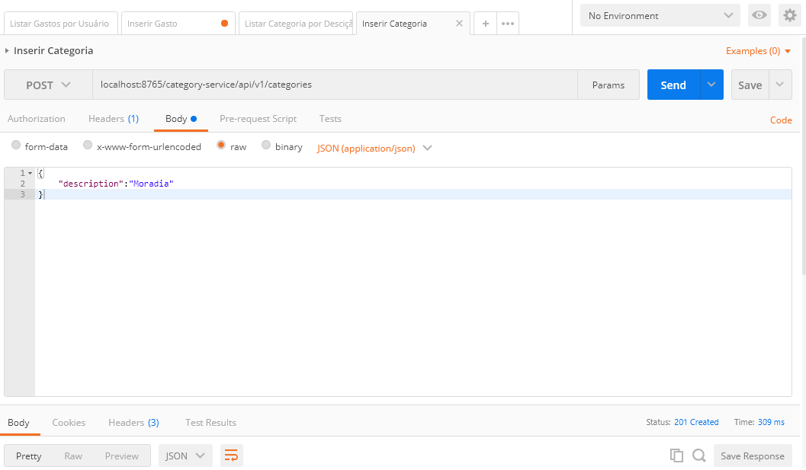
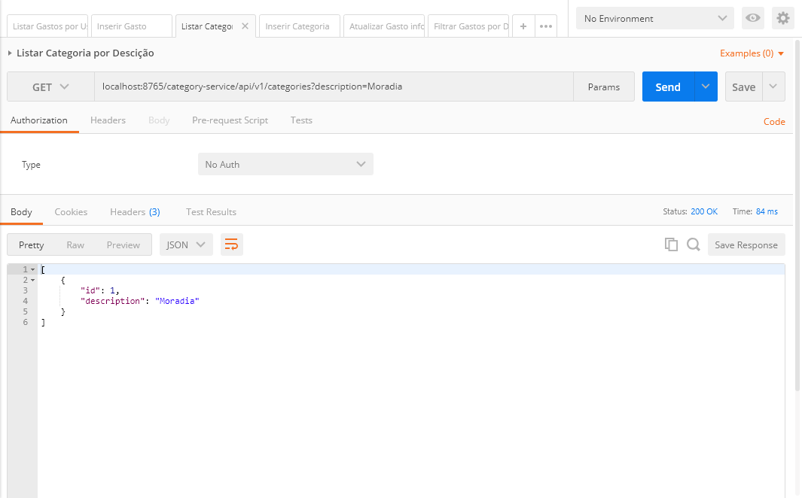
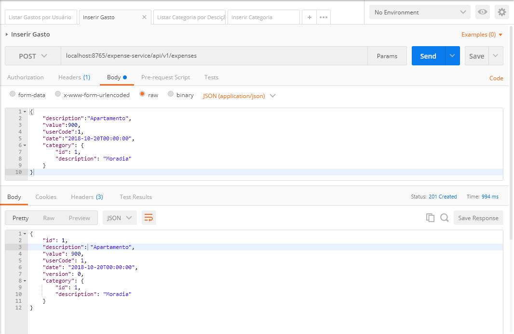
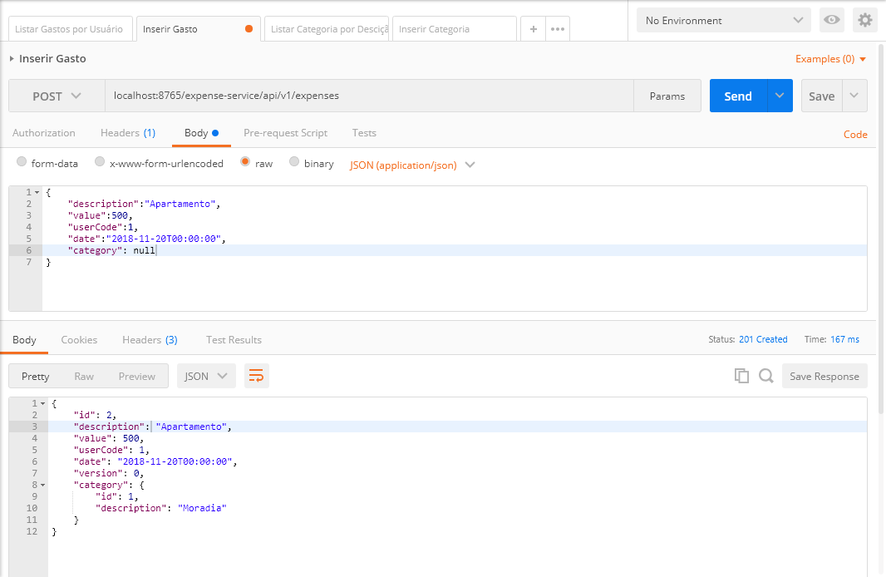
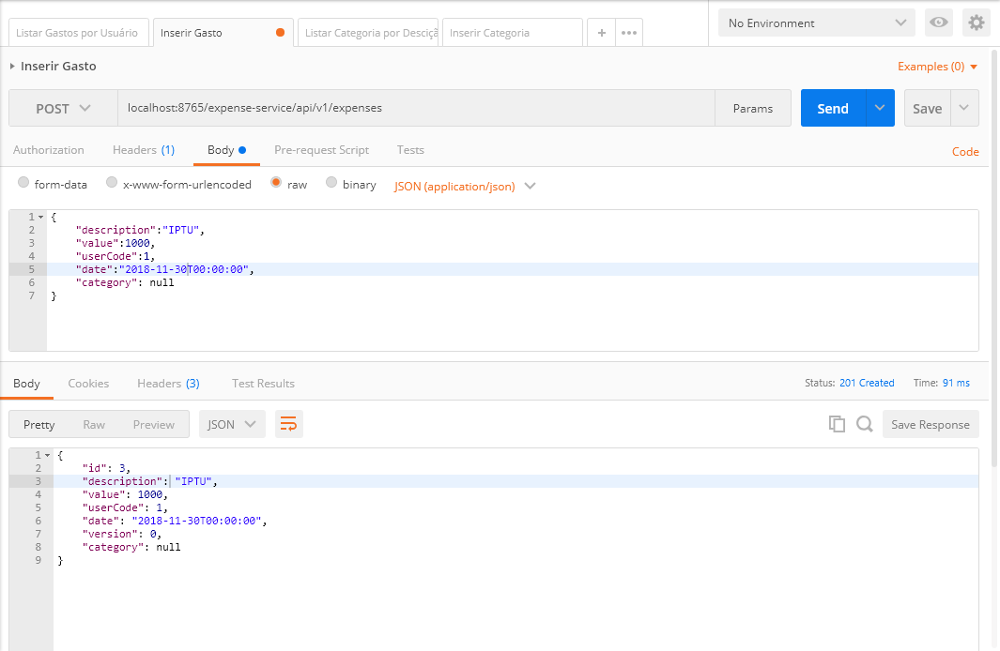
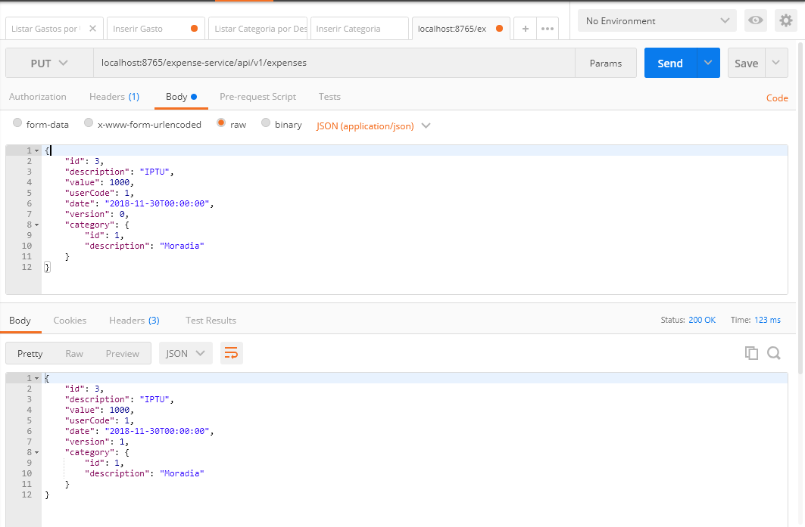
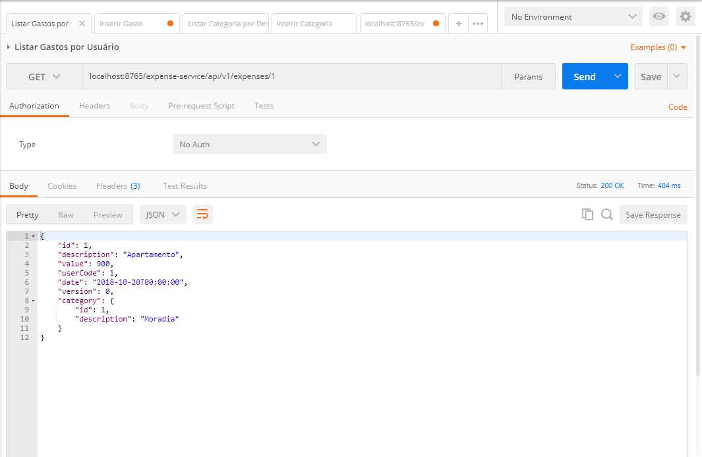
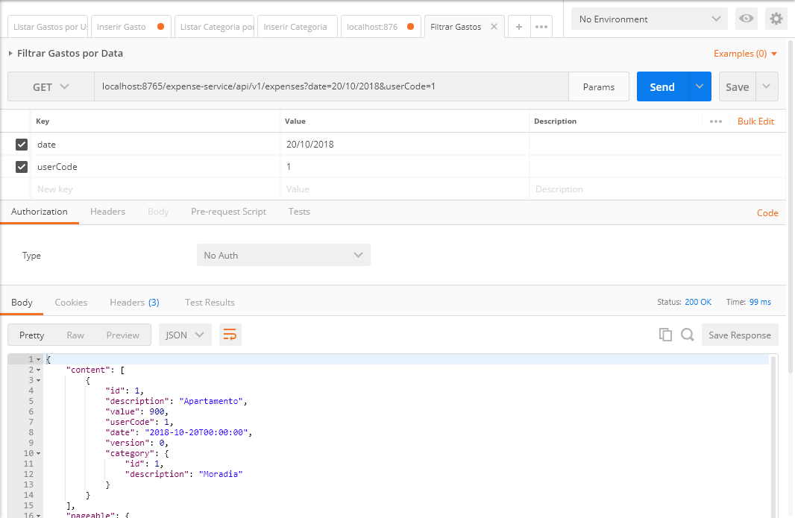
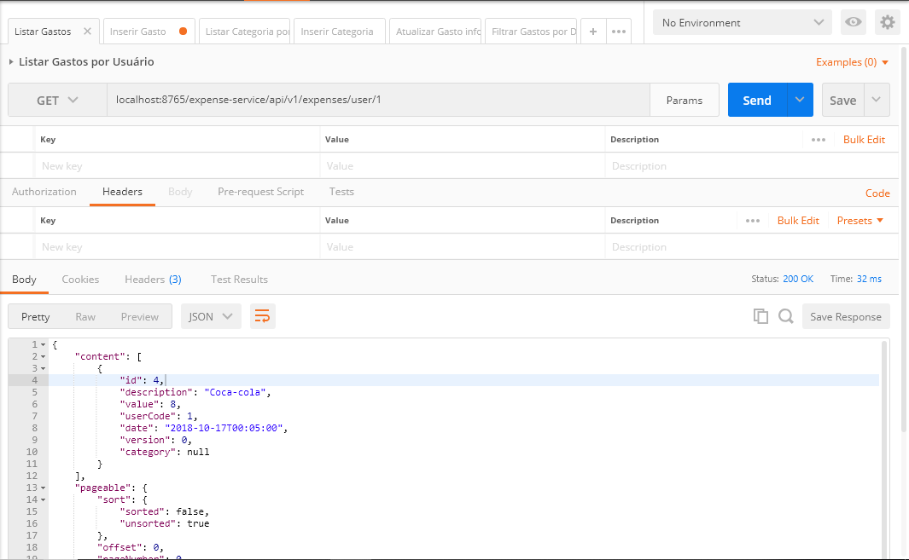

# Empresa recrutadora: Rersouce It

### Para baixar o MySQL
https://dev.mysql.com/downloads/

### Para baixar o Redis: 
https://redis.io/download

### Caso use o sistema operacional Windows:
https://github.com/MicrosoftArchive/redis/releases

na pasta raiz do Redis executar o comando: redis-server redis.windows.conf

#### Mysql
    Persistencia da compras realizadas
	
#### Redis
	Armazenamento de estrutura de dados de chave-valor de código aberto e na memória.
	
	*Justificativa:* Evitam atrasos de tempo de busca e podem acessar dados com algoritmos mais simples que usam menos instruções de CPU
	
#### Server config
	Centralizar os arquivos de configuração dos microserviços
	
#### Eureka
    É um serviço desevolvolvido pela Netflix para **service discovery**.

    *Justificativa:* O uso do Zuul, para criar os cluster

#### Zuul
    É um proxy reverso também desevolvolvido pela Netflix que atua também como um **load balance**, trabalha junto com o Eureka para descoberta e agreção dos nós. Dando a possibilidad de criar um cluster
    com facilidade.
    
    *Justificativa:* O sistema terá um volume de 100k de request/seg, dessa forma o sistema terá que está em cluster com um loadbalance.

### Para executar os projetos:
mvn clean install

mvn spring-boot:run

Subir os projetos na seguinte ordem:

1 - spring-cloud-config-server

2 - netflix-eureka-naming-service

3 - netflix-zuul-api-gateway-server

4 - category-service

5 - expense-service

### Endpoints

Para inserir uma nova categoria

Para buscar categorias sugeridas pelo nome

Para inserir gasto informando a categoria

Para inserir gasto sem informar categoria e receber automaticamente conforme existir relação com outra já inserida anteriormente

Para inserir gasto sem informar categoria

Para atualizar gasto já cadastrado, informado uma categoria

Para buscar gasto por seu identificador

Para filtrar gastos de um usuário em determinada data

Para listar gastos de determinado usuário nos últimos 5 segundos

